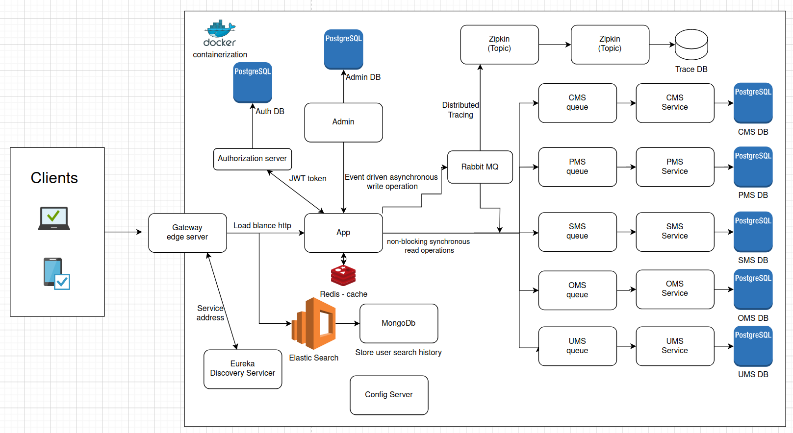
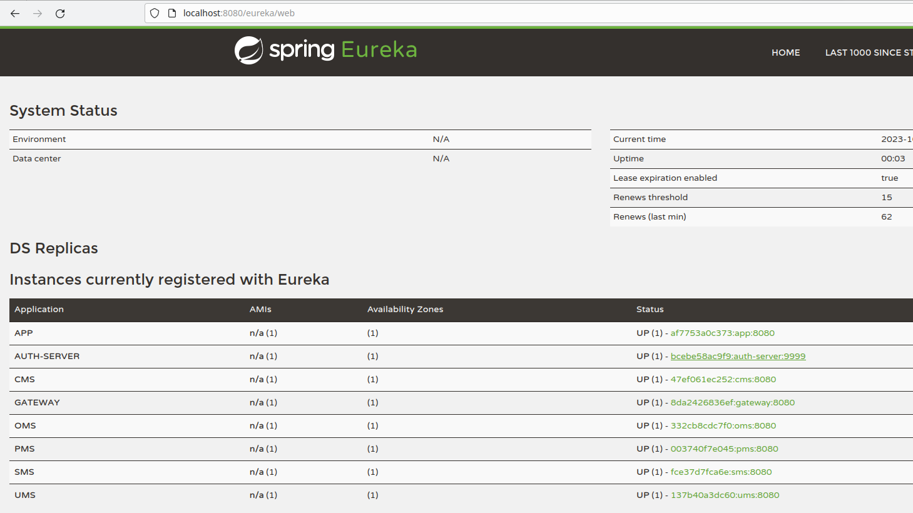
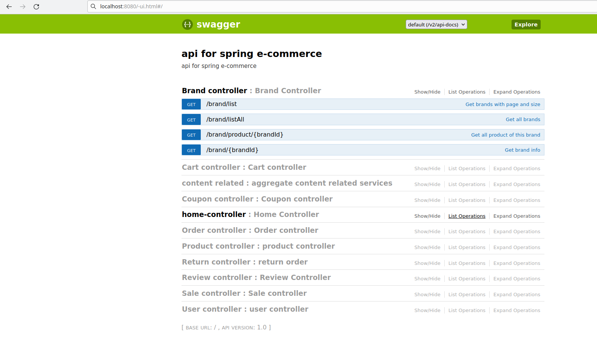

#### Spring E-Commerce microservice

[](https://github.com/JunChen22/E-commerce-microservice/actions/workflows/maven.yml) <a href="https://github.com/JunChen22/E-commerce-React"></a> <a href="https://github.com/JunChen22/E-commerce"></a> <a href="TBD"></a>

E-commerce for medium to large business. The microservice version is multi-vendor platforms.

``` lua
E-commerece 
├── Authuthorization server  -- could replace it with OAuth2 but not implement here
├── config-repo  -- centralized config
├── config-server  -- configuration server/ serverices retrieves their application.yml
├── gateway  -- gateway for connection / not needed in kubernetes
├── eureka   -- service registration and discovery capabilities / not needed in kubernetes
├── kubernetes
│   ├── Helm     -- package manager for Kubernetes that simplifies the deployment and management of microservices.
│   │    ├── common  -- base/boiler plates
│   │    ├── components  -- each services
│   │    └── environment  -- different environment, devolopment vs production 
│   │            └── istio  -- service mesh 
│   └── monitor    -- grafana prometheus - performance metric monitor/visualizer
├── E-commerece-admin  -- role based , keep it monolith first for single vendor
├── E-commerece-app
│   ├── App - aggregated service          non-blocking synchronous API  to 
│   ├── User mangament system/service              5 event driven asynchronous serivces
│   ├── Product management system/service                      
│   ├── Content management system/service
│   ├── Sales mangement system/service
│   └── Order management system/service
└── E-commerece-search   -- searching related module, in-memory imported in data for fast search

Two way of deploying. One with Docker and one with Kubernetes.
Docker by default will be smaller than deploying in Kubernetes. And Kuberentes will have features same as Spring Cloud
like service discovery and load balance (Eureka), central config, Distributed Tracing and circuit breaker.
The .env file stores login infos for easier change. Gets read in during run time by docker.


```


Hibernate is an ORM framework that provides a high-level, declarative way to define your data model in Java and have
Hibernate generate the database schema for you, while MyBatis is a SQL mapper framework that provides a low-level,
programmatic way to interact with a database using SQL statements. MyBatis Generator is a tool that generates Java
code based on an existing database schema to help with building a custom data access layer.

Since using Postgres, there's no support for non-blocking programming model, will use thread pool and scheduler to achieve
psudo non-blocking. Default is 10 threads, but I changed to 2 threads per service due to my 6 core CPU.  Using a thread pool
for the blocking code avoids draining the available threads in the microservice(avoid affecting the non-blocking processing
in the microservice).

Tried separating mbg to another module but kept having problem with it. Either maven or IntelliJ error. Right now it's 
kept together and will separate it later.

API calls and documentations
- get the whole landscape running then
- go to http://localhost:8080/swagger-ui.html
- in API_calls.txt, there's an examples for simples apis.

Set up/installation:

```
  Start whole landscape in docker
 $ mvn clean install
 
 To deploy on docker
 $ docker-compose build       
 $ docker-compose up
 
 or if you want to use Kafka instead of Rabbit MQ
 $ export COMPOSE_FILE=docker-compose-kafka.yml
 unset compose file when you want to switch back to Rabbit MQ
 $ unset COMPOSE_FILE
 
  Import data into elastic search
  
 $ curl -GET 'http://localhost:9200/_cat/indices?v'         // list all the indices
 $ curl -X DELETE 'http://localhost:9200/products'          // delete existing ones
 $ curl -X POST http://localhost:8080/esProduct/importAll   // should return number of items imported

To deploy on kubernetes
 $ chmod +x clean_up.sh && chmod +x setup.sh && chmod +x start.sh && chmod +x update.sh   // enable scripts for common helm commands
 $ cd ./kubernetes
 $ ./setup.sh    // build images and config setting in minikube
 $ ./update.sh   // update helm dependency
 $ ./start.sh    // start and deploy on dev-environment by default
 $ minikube ip   // using this ip address that minikube is on to interact at port 80 plus end points.
 
* can not deploy locally(IDE) only Docker or Kubernetes/Minikube
* also need PayPal sandbox credential to run OMS.

Database and mybatis generator

  Generate mybatis files
 $ chmod +x update_mybatis.sh
 $ ./update_mybatis.sh

or generate the file manually.  

 $ docker-compose up postgres
 $ go to all the directory(Ecom-app App, CMS, OMS, PMS, SMS, UMS, and ECom-admin)
 $ mvn mybatis-generator:generate -Dmybatis.generator.overwrite=true // generate DAO, mapper and java clasees
 $ docker-compose down
 
ps : Remove docker volume so the new data.sql can function properly and update.
```
### Tech stack
| Tech                                                                                   | role                                  | version | How is it being used here                               |
|----------------------------------------------------------------------------------------|---------------------------------------|---------|---------------------------------------------------------|
| [Spring Boot](https://spring.io/projects/spring-boot)                                  | MVC framework                         | 2.5.2   |                                                         |
| [Spring WebFlux](https://docs.spring.io/spring-framework/reference/)                   | Reactive                              | 2.5.2   | Non-blocking APIs and event driven asynchronous service |
| [SpringSecurity](https://spring.io/projects/spring-security)                           | Security                              | 2.5.2   |                                                         |
| [Eureka](https://cloud.spring.io/spring-cloud-netflix/reference/html/)                 | Spring Cloud - Service Discovery      | 2.5.2   | Service discovery                                       |
| [Gateway](https://cloud.spring.io/spring-cloud-netflix/reference/html/)                | Spring Cloud - Gateway                | 2.5.2   | Gateway                                                 |
| [Auth](https://cloud.spring.io/spring-cloud-netflix/reference/html/)                   | Spring Cloud - Auth server            | 2.5.2   | security                                                |
| [PostgreSQL](https://www.postgresql.org/)                                              | SQL database                          | 9.6.10  | store all product and user related data                 |
| [MyBatis](http://www.mybatis.org/mybatis-3/zh/index.html)                              | ORM framework                         | 2.3.0   | ORM(object relation mapping), middle ware               |
| [MyBatisGenerator](http://www.mybatis.org/generator/index.html)                        | Sourcecode generator                  | 1.4.0   | Generate basic functionality(CRUD) to database          |
| [RabbitMQ](https://www.rabbitmq.com/)                                                  | Message queue                         |         |                                                         |
| [Redis](https://redis.io/)                                                             | Cache mechanism                       |         | used like a scheduler here, emails verification         |
| [MongoDB](https://www.mongodb.com)                                                     | NoSql database(search & read history) | 5.0.0   | store user search & view history                        |
| [Elasticsearch](https://github.com/elastic/elasticsearch)                              | Search engine                         | 7,12.0  | imported data from PostgreSQL for fast search           |
| [LogStash](https://github.com/elastic/logstash)                                        | Logging Service                       | 7,12.0  |                                                         |
| [Kibana](https://github.com/elastic/kibana)                                            | Elasticsearch LogStash visualization  | 7,12.0  |                                                         |
| [Nginx](https://www.nginx.com/)                                                        | Webserver / Load balancing            |         |                                                         |
| [Docker](https://www.docker.com)                                                       | Containerization                      |         | Easier deployment                                       |
| [JWT](https://github.com/jwtk/jjwt)                                                    | Encryption tool                       |         |                                                         |
| [Lombok](https://github.com/rzwitserloot/lombok)                                       | minimize boilerplate                  |         |                                                         |
| [PageHelper](http://git.oschina.net/free/Mybatis_PageHelper)                           | MyBatis pagination helper             |         |                                                         |
| [Swagger-UI](https://github.com/swagger-api/swagger-ui)                                | Documentation tool                    |         |                                                         |
| [Hibernate-Validator](http://hibernate.org/validator)                                  | Validation                            |         |                                                         |
| [PayPal](https://developer.paypal.com/home)                                            | Payment Gateway                       | 1.14.0  | Third party payment processor                           |
| [Ubuntu](https://ubuntu.com/)                                                          | OS                                    |         |                                                         |
| AWS S3                                                                                 | File storage                          |         | store images, videos                                    |


Eureka to see which services are available.http://localhost:8080/eureka/web


Swagger
http://localhost:8080/swagger-ui.html


Zipkin to see the interaction between services. http://localhost:9411/zipkin


kubectl
minikube


IntelliJ plugin
- MyBatisCodeHelperPro 3.1.8 (highly needed when writing dao.xml)

Mongo and Redis wasn't being used yet.

App - aggregated service for all 5 services, authentication with Auth server and communicate via jwt token. stateless.

Auth server - local authentication server, will implement Oauth2.0 + OIDC later on.

Admin - admin service with all service functions plus admin exclusive functions. All administrative task implementation is on the service itself.

Search - import data from PMS for quick search and store user search history in MongoDB.

Product management system(PMS) - manage their product catalog, including product data, pricing, and inventory.
- product
- brand
- review

Order management system(OMS) -  manage their order processing, inventory, shipping, and other fulfillment-related tasks.
- order management
- return/refund
- shopping cart

Sales management system(SMS) - manage their sales processes, including lead generation, customer relationship management, and sales analytics.
- sales
 - promotion sales (time frame)
 - flash sales (by short time or by number of sales)
- coupon
- view used coupon history

Content management system(CMS) - create, manage, and publish digital content, such as text, images, and multimedia, on websites or other digital platforms.
- misc things like
 - Contact US
 - Buyer's guide("article")
  - product comparison
  - guide on what to buy
 - about us
 - shipping and return
 - warranty
 - home page(words and pictures)
 - product comparison
 - FAQ

User management system(UMS) - manage user accounts and permissions, including authentication, authorization, and access control.
- User
- admin


### Order process flow

1. add product -> cart,cart items

2. cart items -> checkout -> generate order

3. (will ask for login if your e-commerce requires, this ECom requires)

4. generated (actual) order ->
   calculate final price(coupon, promotion, sale), check stock, lock in stock, shipping
   -> send price to PayPal -> PayPal send customer to their paypal page -> (this part not done by us)
   they choose their payment and agreed amount to pay to PayPal -> PayPal send us pay proof they paid to PayPal,
   and redirect user to success page
   -> use said proof to get the payment to us -> finish post payment work like update stock, generate order
   serial number, create order to our database, delete user shopping cart


Docker:
- https://docs.docker.com/engine/install/ubuntu/

Elastic search:
- https://www.elastic.co/guide/en/elasticsearch/reference/current/deb.html#install-deb

### Material used:
- https://github.com/macrozheng/mall
- https://www.youtube.com/watch?v=EpYBP7EZ8Y4
- https://www.youtube.com/watch?v=-PcU6uf-p3g&list=PLA7e3zmT6XQUNzbNoTb-8c-VTa_i_w5-y

JWT:
- https://auth0.com/blog/implementing-jwt-authentication-on-spring-boot/
- https://dzone.com/articles/spring-boot-security-json-web-tokenjwt-hello-world

MyBatis
- https://mybatis.org/mybatis-3/sqlmap-xml.html